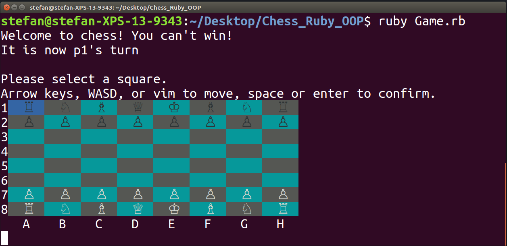

##**Terminal Chess**

Terminal Chess is a chess engine coded in Ruby using Object-Oriented Programming.
The game has a graphical user interface via the colorize gem.

##**Instructions**
* First ensure that the colorize gem is installed by running: gem install colorize
* cd into the root folder and execute ruby Game.rb

##**Views**

